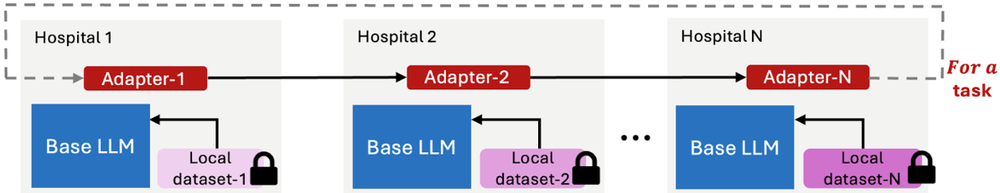

# Multi-institutional Efficient/Distributed Adapter Learning (MEDAL) Framework

This repository implements the MEDAL framework for fine-tuning large language models (LLMs) across multiple institutions without sharing raw data. The code is designed to work with the LLaMA 3.1 8B model and can be adapted to other models with minor modifications to the configuration file.



## Repository Structure

- `LLaMA-3.1-8b/`: Contains code for fine-tuning LLaMA 3.1 8B model using the MEDAL framework.
- `LLaMA-3.1-8b/run_medal.py`: Main script for fine-tuning the LLaMA 3.1 8B model on various datasets.
- `LLaMA-3.1-8b/medal_config.py`: Configuration file for setting up the MEDAL training parameters, datasets, and multi-center training settings.
- `datasets/`: Contains placeholders for datasets used in experiments. The actual datasets are not included due to privacy and size constraints.
- `llm-requirements.txt`: Lists the required libraries and their versions for running the code.
- `setup.sh`: A setup script to install necessary dependencies. It is tested on Ubuntu systems.
- `license.txt`: License information for the repository (Research non-commercial use only).

## Getting Started

1. Clone the repository to your local machine using the following command:
   ```
   git clone https://github.com/ahmedmbakr/MEDAL.git
   ```
2. Run the setup script to install the required dependencies:
   ```
   bash setup.sh
   ```
3. Configure the `medal_config.py` file to set your training parameters, datasets, and multi-center settings. Comments are provided in the file to guide you through the configuration.
4. Run `run_medal.py` to start the fine-tuning process:
    ```
    python LLaMA-3.1-8b/run_medal.py
    ```

## Day to Day Usage

Repeat steps 3 and 4 from the Getting Started section to fine-tune the model on different datasets or with different configurations.

## Citation

If you find this work useful in your research, please consider citing the following paper:

```
TODO: Add citation details here.
```

# Contact

For any questions or issues, please open an issue on the GitHub repository or contact Ahmed Bakr at `ambakr@crimson.ua.edu`.
